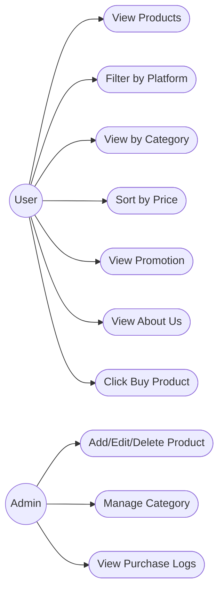

# ชื่อกลุ่ม: 4kon
# รายชื่อนิสิตภายในกลุ่ม:<br>
  <p>67102010163 นายณัฐชนน มลาสินธ์</p>
  <p>67102010508 นายเกียรติยศ ม่วงเปลี่ยน</p>
  <p>67102010512 นายณัชพล โพธิ์ตาดทอง</p>
  <p>67102010513 นายณัฐวุฒิ โตเชื้อ</p>

# 1. ที่มาของปัญหาและความสำคัญ
- ในปัจจุบันการซื้อสินค้าออนไลน์กลายเป็นพฤติกรรมปกติของผู้คน เนื่องจากมีความสะดวก รวดเร็ว และมีตัวเลือกสินค้าที่หลากหลายจากหลายแพลตฟอร์ม เช่น เว็บไซต์อีคอมเมิร์ซและร้านค้าออนไลน์ต่าง ๆ อย่างไรก็ตาม ผู้ใช้งานมักพบปัญหาในการจัดการข้อมูลสินค้าที่ตนเองสนใจ ไม่ว่าจะเป็นการจำรายละเอียดสินค้า ราคา ลิงก์ หรือการเปรียบเทียบสินค้าหลายรายการในเวลาเดียวกัน หลายครั้งผู้ใช้เห็นสินค้าแล้วต้องการซื้อในภายหลัง แต่ไม่สามารถเก็บข้อมูลไว้ได้อย่างเป็นระบบ ทำให้เกิดปัญหาการลืมสินค้า ลืมราคา หรือเสียเวลาในการค้นหาใหม่อีกครั้ง
นอกจากนี้ การวางแผนการใช้จ่ายเพื่อซื้อสินค้ายังเป็นเรื่องสำคัญ โดยเฉพาะในกลุ่มนักเรียน นักศึกษา หรือผู้ที่มีงบประมาณจำกัด หากไม่มีเครื่องมือช่วยจัดการรายการสินค้าที่อยากซื้อ ก็อาจทำให้เกิดการใช้จ่ายเกินความจำเป็น หรือไม่สามารถจัดลำดับความสำคัญของสิ่งที่ต้องการได้อย่างเหมาะสม
ดังนั้น จึงเกิดแนวคิดในการพัฒนาเว็บแอปพลิเคชันที่ช่วยให้ผู้ใช้งานสามารถบันทึกและจัดการข้อมูลสินค้าที่ตนเองสนใจได้อย่างเป็นระบบ โดยรวบรวมรายละเอียดสำคัญของสินค้าไว้ในที่เดียว เพื่ออำนวยความสะดวกในการวางแผนการซื้อและช่วยให้การตัดสินใจมีประสิทธิภาพมากขึ้น

# 2.จุดประสงค์ของโครงงาน
- โครงงานนี้มีจุดประสงค์เพื่อพัฒนาเว็บแอปพลิเคชันสำหรับช่วยผู้ใช้งานในการจัดการรายการสินค้าที่ต้องการซื้อ โดยผู้ใช้สามารถเพิ่มข้อมูลสินค้าได้ด้วยตนเอง เช่น รูปภาพสินค้า ราคา ประเภทสินค้า และลิงก์แหล่งที่มา ระบบจะช่วยรวบรวมข้อมูลเหล่านี้ไว้ในรูปแบบที่เป็นระเบียบ ง่ายต่อการค้นหาและเปรียบเทียบ
อีกทั้งโครงงานยังมุ่งเน้นให้ผู้ใช้สามารถวางแผนการใช้จ่ายได้อย่างมีประสิทธิภาพ ผ่านการดูรายการสินค้าทั้งหมดที่สนใจ ซึ่งช่วยให้ผู้ใช้มองเห็นภาพรวมของค่าใช้จ่ายที่อาจเกิดขึ้นในอนาคต นำไปสู่การตัดสินใจซื้ออย่างรอบคอบ ลดการซื้อแบบฉับพลัน และส่งเสริมการบริหารเงินส่วนบุคคล
นอกจากนี้ โครงงานยังเป็นการฝึกกระบวนการพัฒนาซอฟต์แวร์แบบเป็นขั้นตอน ตั้งแต่การเก็บความต้องการของผู้ใช้ การวิเคราะห์และออกแบบระบบ การทำงานร่วมกันเป็นทีม ไปจนถึงการใช้เครื่องมือจัดการโครงงาน เช่น GitHub ในการติดตามงานและควบคุมเวอร์ชัน ซึ่งช่วยเสริมสร้างทักษะที่จำเป็นสำหรับการพัฒนาระบบจริงในอนาคต

# 3.ขอบเขตของโครงงาน
 
  # ขอบเขตด้านผู้ใช้งาน โดยผู้ใช้งานทั่วไปสามารถ:
```
 1.ดูรายการสินค้าจาก Shopee และ Lazada
 2.แยกดูสินค้าเป็นหมวดหมู่ (Category)
 3.กรองแหล่งที่มาของสินค้า เช่น แสดงเฉพาะ Shopee หรือ Lazada
 4.เรียงลำดับราคาสินค้า (จากน้อยไปมาก / มากไปน้อย)
 5.ดูสินค้าโปรโมชั่น (Promotion)
 6.เข้าดูหน้า About Us เพื่อดูข้อมูลเกี่ยวกับบริษัท/ทีมพัฒนา
```
# ขอบเขตด้านผู้ดูแลระบบ โดยผู้ดูแลระบบสามารถ:
```
 1.เพิ่มสินค้าใหม่เข้าสู่ระบบ
 2.แก้ไขข้อมูลสินค้า
 3.ลบสินค้าออกจากระบบ
 4.จัดการหมวดหมู่สินค้า
 5.ตรวจสอบ Log การกดซื้อสินค้าจากเว็บไซต์
 6.มีหน้าต่าง dash board ทางสถิติเพื่อสามารถเปรียบเทียบข้อมูลต่างๆได้
```
# ขอบเขตด้านแพลตฟอร์ม :
```
 ระบบต้องสามารถใช้งานได้ผ่านเว็บเบราว์เซอร์ และรองรับการแสดงผลทั้งบน:
  :คอมพิวเตอร์ (PC)
  :โทรศัพท์มือถือ (Mobile)
```

# 4.User story

# 5.Functional Requirements and NON-Functional Requirements
```
#Functional Requirement
<p>1.ระบบต้องแยกหมวดหมู่สินค้าได้ ผู้ใช้สามารถดูสินค้าแยกตาม Category</p>
<p>2.ระบบต้องกรองแหล่งที่มาของสินค้าได้ ผู้ใช้สามารถเลือกดูเฉพาะสินค้าจาก Shopee หรือ Lazada เท่านั้น
<p>3.ระบบต้องเรียงราคาสินค้าได้ ผู้ใช้สามารถเรียงลำดับราคาจากน้อยไปมาก หรือมากไปน้อย
<p>4.ระบบต้องมีระบบจัดการสินค้า (เพิ่ม/ลบ/แก้ไข) Admin สามารถเพิ่ม ลบ และแก้ไขข้อมูลสินค้าได้
<p>5.ระบบต้องมีการกำหนดบทบาทผู้ใช้ (Role Management) แยกระหว่าง Admin และ User พร้อมสิทธิ์การใช้งานที่แตกต่างกัน
<p>6.ระบบต้องรองรับการแสดง Promotion แสดงสินค้าลดราคา หรือโปรโมชันพิเศษ
<p>7.ระบบต้องมีหน้า About Us แสดงข้อมูลเกี่ยวกับบริษัทหรือทีมพัฒนา
<p>8.ระบบต้องบันทึก Log การกดซื้อสินค้า Admin สามารถดูประวัติการคลิกซื้อจากเว็บไซต์ได้

```

```
#Non-Functional Requirment
1.ระบบต้องใช้โทนสีหลักเพียงโทนเดียวตลอดทั้งแอปพลิเคชัน เช่น โทนฟ้า หรือโทนเทา-แดง และต้องไม่ใช้หลายสีปนกันเพื่อคงความสม่ำเสมอของการออกแบบ
2.ระบบต้องสามารถรองรับผู้ใช้งานจำนวนมากพร้อมกันได้ โดยไม่เกิดอาการช้า ค้าง หรือหน่วงในการแสดงผลหรือประมวลผลข้อมูล
3.หน้าเว็บต้องแสดงผลได้อย่างเหมาะสมทั้งบนคอมพิวเตอร์ (PC) และอุปกรณ์พกพา (Mobile) โดยใช้การออกแบบแบบ Responsive Design
4.ระบบต้องออกแบบให้ใช้งานง่าย เมนูชัดเจน เข้าใจได้ทันที ลดความซับซ้อน เพื่อให้ผู้ใช้สามารถใช้งานได้โดยไม่ต้องมีคู่มือ
5.ระบบต้องหลีกเลี่ยงการใช้ Animation ที่มากเกินไป เพื่อไม่ให้กระทบต่อความเร็วของระบบ และไม่รบกวนประสบการณ์การใช้งานของผู้ใช้
6.ระบบบันทึก Log การกดซื้อสินค้าต้องทำงานถูกต้องทุกครั้ง และข้อมูลต้องไม่สูญหายแม้เกิดข้อผิดพลาดของระบบบางส่วน
7.โครงสร้างโค้ดของระบบต้องออกแบบให้สามารถแก้ไข ปรับปรุง หรือเพิ่มฟีเจอร์ในอนาคตได้ง่าย เช่น การแยกส่วนการทำงานของระบบอย่างชัดเจน
```

# 6.Use-case diagram


# 7.Process / Methods / Tools

# 8.Requirement
  https://youtu.be/8w2v3BGQ4U4
  https://youtu.be/pAoNU3hhO08
# 9.Retrospective
https://youtu.be/8w2v3BGQ4U4
# 10.Product Backlog

# 11.Sprint Backlog
