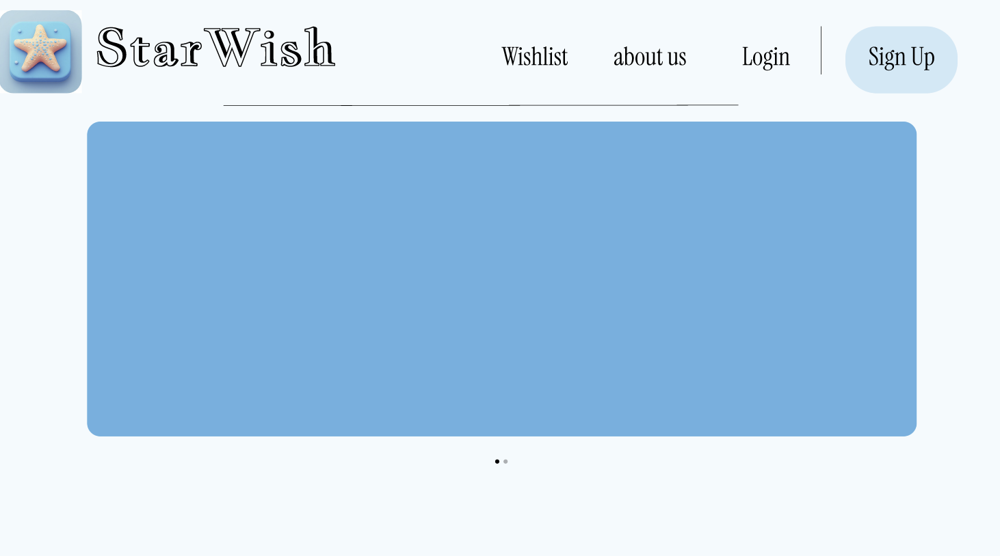
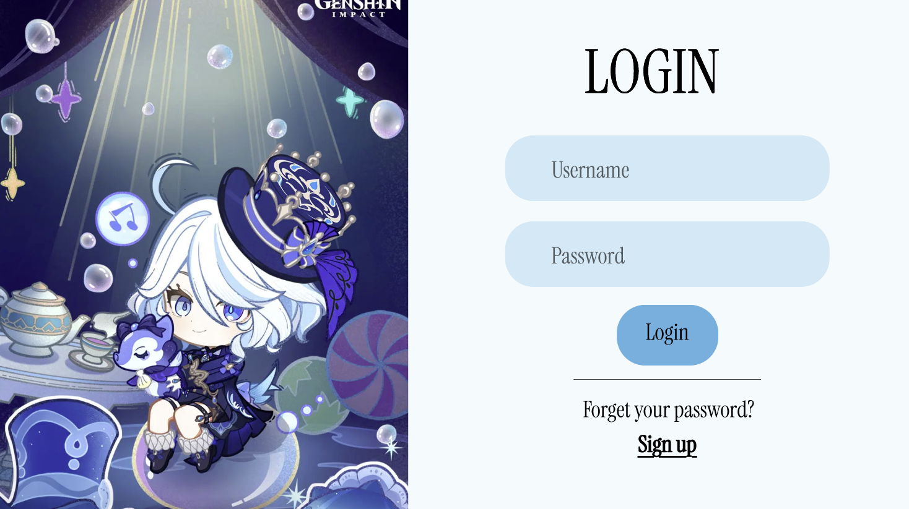
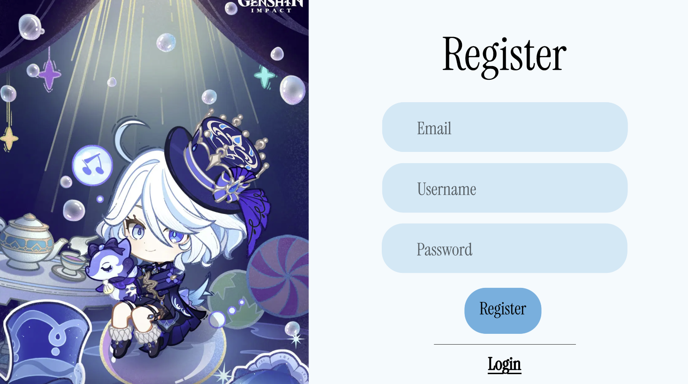
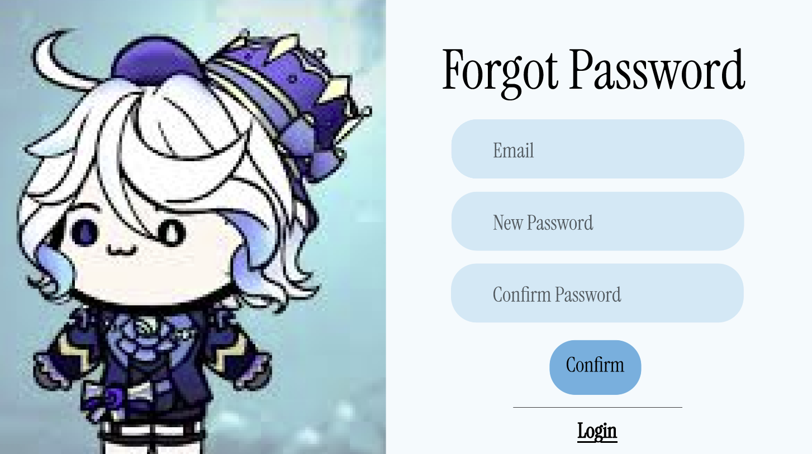
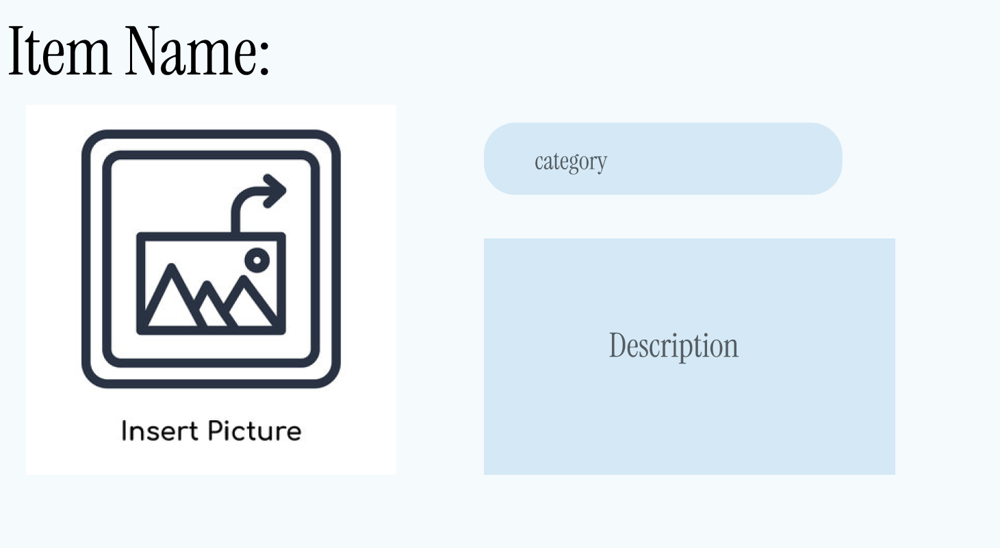
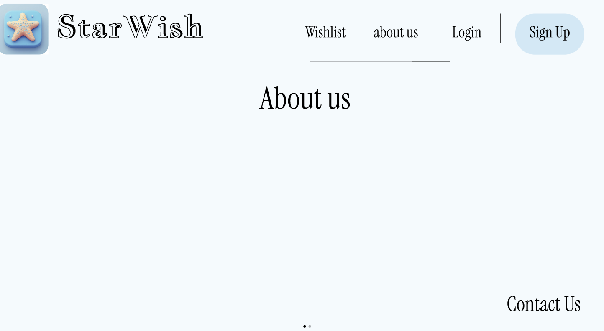
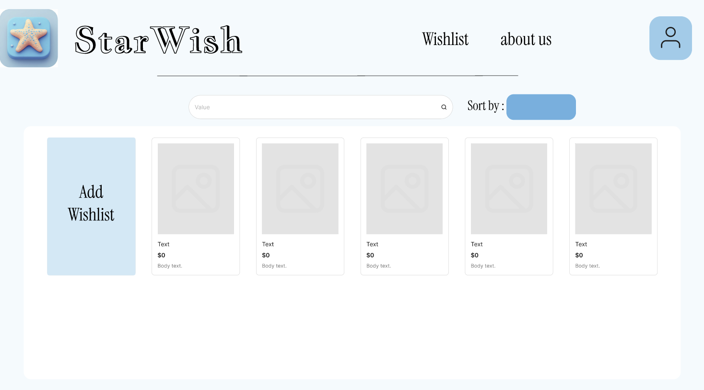

# ชื่อกลุ่ม: 4kon
# รายชื่อนิสิตภายในกลุ่ม:<br>
  <p>67102010163 นายณัฐชนน มลาสินธ์</p>
  <p>67102010508 นายเกียรติยศ ม่วงเปลี่ยน</p>
  <p>67102010512 นายณัชพล โพธิ์ตาดทอง</p>
  <p>67102010513 นายณัฐวุฒิ โตเชื้อ</p>

# 1. ที่มาของปัญหาและความสำคัญ<br>
- ในปัจจุบันการซื้อสินค้าออนไลน์กลายเป็นพฤติกรรมปกติของผู้คน เนื่องจากมีความสะดวก รวดเร็ว และมีตัวเลือกสินค้าที่หลากหลายจากหลายแพลตฟอร์ม เช่น เว็บไซต์อีคอมเมิร์ซและร้านค้าออนไลน์ต่าง ๆ อย่างไรก็ตาม ผู้ใช้งานมักพบปัญหาในการจัดการข้อมูลสินค้าที่ตนเองสนใจ ไม่ว่าจะเป็นการจำรายละเอียดสินค้า ราคา ลิงก์ หรือการเปรียบเทียบสินค้าหลายรายการในเวลาเดียวกัน หลายครั้งผู้ใช้เห็นสินค้าแล้วต้องการซื้อในภายหลัง แต่ไม่สามารถเก็บข้อมูลไว้ได้อย่างเป็นระบบ ทำให้เกิดปัญหาการลืมสินค้า ลืมราคา หรือเสียเวลาในการค้นหาใหม่อีกครั้ง
นอกจากนี้ การวางแผนการใช้จ่ายเพื่อซื้อสินค้ายังเป็นเรื่องสำคัญ โดยเฉพาะในกลุ่มนักเรียน นักศึกษา หรือผู้ที่มีงบประมาณจำกัด หากไม่มีเครื่องมือช่วยจัดการรายการสินค้าที่อยากซื้อ ก็อาจทำให้เกิดการใช้จ่ายเกินความจำเป็น หรือไม่สามารถจัดลำดับความสำคัญของสิ่งที่ต้องการได้อย่างเหมาะสม
ดังนั้น จึงเกิดแนวคิดในการพัฒนาเว็บแอปพลิเคชันที่ช่วยให้ผู้ใช้งานสามารถบันทึกและจัดการข้อมูลสินค้าที่ตนเองสนใจได้อย่างเป็นระบบ โดยรวบรวมรายละเอียดสำคัญของสินค้าไว้ในที่เดียว เพื่ออำนวยความสะดวกในการวางแผนการซื้อและช่วยให้การตัดสินใจมีประสิทธิภาพมากขึ้น

# 2.จุดประสงค์ของโครงงาน<br>
- โครงงานนี้มีจุดประสงค์เพื่อพัฒนาเว็บแอปพลิเคชันสำหรับช่วยผู้ใช้งานในการจัดการรายการสินค้าที่ต้องการซื้อ โดยผู้ใช้สามารถเพิ่มข้อมูลสินค้าได้ด้วยตนเอง เช่น รูปภาพสินค้า ราคา ประเภทสินค้า และลิงก์แหล่งที่มา ระบบจะช่วยรวบรวมข้อมูลเหล่านี้ไว้ในรูปแบบที่เป็นระเบียบ ง่ายต่อการค้นหาและเปรียบเทียบ
อีกทั้งโครงงานยังมุ่งเน้นให้ผู้ใช้สามารถวางแผนการใช้จ่ายได้อย่างมีประสิทธิภาพ ผ่านการดูรายการสินค้าทั้งหมดที่สนใจ ซึ่งช่วยให้ผู้ใช้มองเห็นภาพรวมของค่าใช้จ่ายที่อาจเกิดขึ้นในอนาคต นำไปสู่การตัดสินใจซื้ออย่างรอบคอบ ลดการซื้อแบบฉับพลัน และส่งเสริมการบริหารเงินส่วนบุคคล
นอกจากนี้ โครงงานยังเป็นการฝึกกระบวนการพัฒนาซอฟต์แวร์แบบเป็นขั้นตอน ตั้งแต่การเก็บความต้องการของผู้ใช้ การวิเคราะห์และออกแบบระบบ การทำงานร่วมกันเป็นทีม ไปจนถึงการใช้เครื่องมือจัดการโครงงาน เช่น GitHub ในการติดตามงานและควบคุมเวอร์ชัน ซึ่งช่วยเสริมสร้างทักษะที่จำเป็นสำหรับการพัฒนาระบบจริงในอนาคต

# 3.ขอบเขตของโครงงาน<br>
 
  # ขอบเขตด้านผู้ใช้งาน โดยผู้ใช้งานทั่วไปสามารถ:
```
 1.ดูรายการสินค้าจาก Shopee และ Lazada
 2.แยกดูสินค้าเป็นหมวดหมู่ (Category)
 3.กรองแหล่งที่มาของสินค้า เช่น แสดงเฉพาะ Shopee หรือ Lazada
 4.เรียงลำดับราคาสินค้า (จากน้อยไปมาก / มากไปน้อย)
 5.ดูสินค้าโปรโมชั่น (Promotion)
 6.เข้าดูหน้า About Us เพื่อดูข้อมูลเกี่ยวกับบริษัท/ทีมพัฒนา
```
# ขอบเขตด้านผู้ดูแลระบบ โดยผู้ดูแลระบบสามารถ:
```
 1.เพิ่มสินค้าใหม่เข้าสู่ระบบ
 2.แก้ไขข้อมูลสินค้า
 3.ลบสินค้าออกจากระบบ
 4.จัดการหมวดหมู่สินค้า
 5.ตรวจสอบ Log การกดซื้อสินค้าจากเว็บไซต์
 6.มีหน้าต่าง dash board ทางสถิติเพื่อสามารถเปรียบเทียบข้อมูลต่างๆได้
```
# ขอบเขตด้านแพลตฟอร์ม 
```
 ระบบต้องสามารถใช้งานได้ผ่านเว็บเบราว์เซอร์ และรองรับการแสดงผลทั้งบน:
  :คอมพิวเตอร์ (PC)
  :โทรศัพท์มือถือ (Mobile)
```

# 4. User Story

**1. User Story Login**  
ในฐานะผู้ใช้งาน (User) ฉันต้องสามารถ login ด้วย gmail/username และ password เพื่อที่จะได้เข้าสู่ระบบได้  

**2. User Story Register**  
ในฐานะผู้ใช้งาน ฉันต้องการสมัครสมาชิกด้วยอีเมล เพื่อให้สามารถเข้าใช้งานระบบได้  

**3. User Story Logout**  
ในฐานะผู้ใช้งาน ฉันต้องการออกจากระบบ เพื่อป้องกันผู้อื่นเข้าถึงบัญชีของฉัน  

**4. User Story Forgot Password**  
ในฐานะผู้ใช้งาน ฉันต้องการรีเซ็ตรหัสผ่านเมื่อจำไม่ได้ เพื่อกลับเข้าสู่ระบบได้อีกครั้ง  

**5. User Story Add Product Description**  
ในฐานะผู้ใช้งาน ฉันต้องการเขียน description เพื่อที่ฉันจะสามารถย้อนกลับมาดูรายละเอียดสินค้า  

**6. User Story Add Picture of Product**  
ในฐานะผู้ใช้งาน ฉันต้องการเพิ่มรูปสินค้า เพื่อให้สามารถเห็นลักษณะสินค้าก่อนตัดสินใจซื้อ  

**7. User Story Add Price of Product**  
ในฐานะผู้ใช้งาน ฉันต้องการดูราคาสินค้า เพื่อใช้เปรียบเทียบก่อนตัดสินใจซื้อ  

**8. User Story Add Tags**  
ในฐานะผู้ใช้งาน ฉันต้องการเพิ่มแท็กสินค้า เพื่อให้สามารถค้นหาและพบสินค้าที่เกี่ยวข้องได้ง่ายขึ้น  

**9. User Story Add Link**  
ในฐานะผู้ใช้งาน ฉันต้องการเพิ่มลิงก์สินค้า เพื่อให้รู้ว่าสินค้านี้มาจากแพลตฟอร์มใด  

**10. User Story Favorite**  
ในฐานะผู้ใช้งาน ฉันต้องการเพิ่มรายการสินค้าที่สนใจ เพื่อให้สามารถกลับมาดูหรือซื้อในภายหลังได้  

**11. User Story Category**  
ในฐานะผู้ใช้งาน ฉันต้องการดูสินค้าแยกตามหมวดหมู่ เพื่อให้ค้นหาสินค้าที่ต้องการได้ง่ายขึ้น  

**12. User Story Price Filter**  
ในฐานะผู้ใช้งาน ฉันต้องการเรียงลำดับราคาสินค้า เพื่อเปรียบเทียบราคาได้ง่าย  

**13. User Story Store Filter**  
ในฐานะผู้ใช้งาน ฉันต้องการกรองสินค้าตามแหล่งที่มา เช่น Shopee หรือ Lazada  

**14. User Story Promotion**  
ในฐานะผู้ใช้งาน ฉันต้องการดูสินค้าที่มีโปรโมชั่น  

**15. User Story Manage Category**  
ในฐานะผู้ดูแลระบบ (Admin) ฉันต้องการจัดการหมวดหมู่สินค้า  

**16. User Story Manage Promotion**  
ในฐานะผู้ดูแลระบบ ฉันต้องการจัดการข้อมูลโปรโมชั่น  

**17. User Story Dashboard**  
ในฐานะผู้ดูแลระบบ ฉันต้องการดูประวัติการกดซื้อสินค้า


# 5.Functional Requirements and NON-Functional Requirements<br>
```
#Functional Requirement
<p>1.ระบบต้องแยกหมวดหมู่สินค้าได้ ผู้ใช้สามารถดูสินค้าแยกตาม Category</p>
<p>2.ระบบต้องกรองแหล่งที่มาของสินค้าได้ ผู้ใช้สามารถเลือกดูเฉพาะสินค้าจาก Shopee หรือ Lazada เท่านั้น
<p>3.ระบบต้องเรียงราคาสินค้าได้ ผู้ใช้สามารถเรียงลำดับราคาจากน้อยไปมาก หรือมากไปน้อย
<p>4.ระบบต้องมีระบบจัดการสินค้า (เพิ่ม/ลบ/แก้ไข) Admin สามารถเพิ่ม ลบ และแก้ไขข้อมูลสินค้าได้
<p>5.ระบบต้องมีการกำหนดบทบาทผู้ใช้ (Role Management) แยกระหว่าง Admin และ User พร้อมสิทธิ์การใช้งานที่แตกต่างกัน
<p>6.ระบบต้องรองรับการแสดง Promotion แสดงสินค้าลดราคา หรือโปรโมชันพิเศษ
<p>7.ระบบต้องมีหน้า About Us แสดงข้อมูลเกี่ยวกับบริษัทหรือทีมพัฒนา
<p>8.ระบบต้องบันทึก Log การกดซื้อสินค้า Admin สามารถดูประวัติการคลิกซื้อจากเว็บไซต์ได้

```

```
#Non-Functional Requirment
1.ระบบต้องใช้โทนสีหลักเพียงโทนเดียวตลอดทั้งแอปพลิเคชัน เช่น โทนฟ้า หรือโทนเทา-แดง และต้องไม่ใช้หลายสีปนกันเพื่อคงความสม่ำเสมอของการออกแบบ
2.ระบบต้องสามารถรองรับผู้ใช้งานจำนวนมากพร้อมกันได้ โดยไม่เกิดอาการช้า ค้าง หรือหน่วงในการแสดงผลหรือประมวลผลข้อมูล
3.หน้าเว็บต้องแสดงผลได้อย่างเหมาะสมทั้งบนคอมพิวเตอร์ (PC) และอุปกรณ์พกพา (Mobile) โดยใช้การออกแบบแบบ Responsive Design
4.ระบบต้องออกแบบให้ใช้งานง่าย เมนูชัดเจน เข้าใจได้ทันที ลดความซับซ้อน เพื่อให้ผู้ใช้สามารถใช้งานได้โดยไม่ต้องมีคู่มือ
5.ระบบต้องหลีกเลี่ยงการใช้ Animation ที่มากเกินไป เพื่อไม่ให้กระทบต่อความเร็วของระบบ และไม่รบกวนประสบการณ์การใช้งานของผู้ใช้
6.ระบบบันทึก Log การกดซื้อสินค้าต้องทำงานถูกต้องทุกครั้ง และข้อมูลต้องไม่สูญหายแม้เกิดข้อผิดพลาดของระบบบางส่วน
7.โครงสร้างโค้ดของระบบต้องออกแบบให้สามารถแก้ไข ปรับปรุง หรือเพิ่มฟีเจอร์ในอนาคตได้ง่าย เช่น การแยกส่วนการทำงานของระบบอย่างชัดเจน
```

# 6.Use-case diagram<br>


# 7.Process / Methods / Tools<br>
#Process and Methods
```
ใช้กระบวนการพัฒนาซอฟต์แวร์แบบ Agile / Scrum
แบ่งการทำงานออกเป็น Sprint
มีการประชุมทีมเพื่อวางแผนและติดตามความคืบหน้าอย่างสม่ำเสมอ

#Tool
GitHub สำหรับจัดการซอร์สโค้ดและติดตามงาน
Visual Studio Code สำหรับพัฒนาโปรแกรม
Figma สำหรับออกแบบ UI
Web Browser สำหรับทดสอบระบบ
```
# 8.Requirement<br>
  <p>https://youtu.be/8w2v3BGQ4U4 คลิปให้ requirement กลุ่มอื่น</p>
  <p>https://youtu.be/pAoNU3hhO08 คลิปได้รับ requirement จากอาจารย์วีรยุทธ</p>
  
# 9.Retrospective<br>
https://youtu.be/8w2v3BGQ4U4
- 1.เวลาไม่ตรงกัน ทำให้เวลาทำงานร่วมกันน้อยลงพวกเราแต่ละคนมี ภารกิจส่วนตัว และเวลาว่างที่แตกต่างกัน ส่งผลให้ยากต่อการนัดประชุมหรือทำงานพร้อมกันทั้งทีม บางครั้งต้องเลื่อนงานออกไปเพราะไม่สามารถรวมตัวกันได้ครบ ทำให้ความคืบหน้าของงานล่าช้า และขาดความต่อเนื่องในการทำงานต่างๆ
แนวทางปรับปรุง:ทีมจะกำหนดช่วงเวลาประจำสัปดาห์สำหรับการประชุมออนไลน์กัน เพื่ออัปเดตงานแทนการรอพบกันแบบพร้อมหน้า

- 2.ไม่ค่อยได้พูดคุยกัน ทำให้ประสานงานกันไม่ดี ที่ผ่านมา พวกเราในทีมไม่ค่อยได้พูดคุยหรือรายงานความคืบหน้าของงาน ทำให้ไม่ทราบว่าแต่ละคนทำงานถึงขั้นตอนไหนแล้ว ทำให้บางครั้งงานของแต่ละคนจึงไม่เชื่อมต่อกัน หรือทำให้ข้าใจผิดเกี่ยวกับสิ่งที่ต้องทำ
แนวทางปรับปรุง:กำหนดให้มีการอัปเดตสถานะงานเป็นระยะ เช่น สรุปงานที่ทำในแต่ละสัปดาห์ผ่าน ประชุม

- 3.ก่อนหน้านี้พวกเราไม่มีการกำหนดหน้าที่รับผิดชอบอย่างชัดเจน ทำให้บางครั้งสมาชิกทำงานซ้ำกันในส่วนเดียวกัน เช่น ตอนที่เเมกกี้ทำ Tor เเต่ J ก็ได้ทำไปก่อนเเล้ว ส่งผลให้เกิดความไม่สมดุลของภาระงาน และเสียเวลาในการแก้ไข
แนวทางปรับปรุง:เราจะกำหนดบทบาทของแต่ละคนให้ชัดเจนตั้งแต่เริ่มงาน

- 4.บางครั้งพวกเราก็เข้าใจ Requirement ไม่ตรงกัน ทำให้สมาชิกแต่ละคนตีความโจทย์ไม่เหมือนกัน บางคนคิดว่าระบบต้องมีฟีเจอร์หนึ่ง แต่อีกคนเห็นว่าไม่จำเป็น ทำให้งานบางส่วนที่ทำออกมาไม่ตรงตามเป้าหมาย 
แนวทางปรับปรุง:ก่อนเริ่มพัฒนา ทีมจะช่วยกันสรุป Requirement และ User Story ให้ชัดเจน 
# 10.Product Backlog<br>
```
1.ระบบ Login และ Role Management	สูง
2.ระบบเพิ่ม/ลบ/แก้ไขสินค้า	สูง
3.ระบบหมวดหมู่สินค้า	สูง
4.ระบบกรองและเรียงราคา	กลาง
5.ระบบโปรโมชัน	กลาง
6.หน้า About Us	ต่ำ
7.ระบบบันทึก Log การกดซื้อ	สูง
```
# 11.Sprint Backlog 
```
Sprint 1
วิเคราะห์ความต้องการระบบ
ออกแบบ UI และโครงสร้างฐานข้อมูล

Sprint 2
พัฒนาระบบจัดการสินค้า
พัฒนาระบบหมวดหมู่และการเรียงราคา

Sprint 3
พัฒนาระบบ Role Management และ Log
ทดสอบระบบและปรับปรุง

```
#FIGMA LINK
```
https://www.figma.com/design/wgFBc7bKk6GCeVu5BbA4CB/4kon?node-id=0-1&p=f&t=hS07W6DfIaNagzZg-0
```









# Process, Methods, and Tools (Phase 2)
```
#1.Project Tracking
ทีมใช้ github ในการติดตามสถานะของงาน โดยแบ่งงานออกเป็น 3 สถานะหลัก ได้แก่:
 To Do – งานที่ต้องทำ
 In Progress – งานที่กำลังดำเนินการ
 Done – งานที่เสร็จแล้ว
สมาชิกในทีมจะทำการอัปเดตสถานะของงานทุกครั้งที่มีความคืบหน้า เพื่อให้ทุกคนสามารถติดตามภาพรวมของโปรเจกต์ได้แบบ real-time
```
```
#2. Scrum & Meeting
ทีมใช้แนวคิดของ Agile Scrum ในการพัฒนา โดยมีการประชุมอย่างสม่ำเสมอ:
 Daily / Every 1 week Scrum
  อัปเดตว่าแต่ละคนทำอะไรไปแล้ว
  มีปัญหาอะไรหรือไม่
  แผนงานถัดไปคืออะไร
 Sprint Planning
  วางแผนงานก่อนเริ่มแต่ละช่วง
 Retrospective
  สรุปสิ่งที่ทำได้ดี และสิ่งที่ควรปรับปรุง
```
```
#3. Version Control & Branching Strategy
  ทีมใช้ Git และ GitHub ในการจัดการ source code
```
```
#4. Commit Message Convention
   feat: (Feature) ใช้เมื่อเพิ่มความสามารถใหม่ (เทียบกับที่คุณใช้ Adding หรือ Create)
    ตัวอย่าง: feat: add user login validation
   fix: ใช้เมื่อแก้ Bug
    ตัวอย่าง: fix: resolve navigation menu overlay issue
   docs: ใช้เมื่อแก้ไขเอกสาร (README, comments)
    ตัวอย่าง: docs: update installation guide
   style: ใช้เมื่อปรับแต่งความสวยงามของ Code (format, missing semi-colons) ที่ไม่กระทบ Logic
    refactor: ใช้เมื่อแก้ Code ให้ดีขึ้น แต่ทำงานเหมือนเดิม
```
```
#5. Communication
  ทีมใช้เครื่องมือสื่อสารเพื่อประสานงาน ได้แก่:
  Discord – ใช้คุยงานและแชร์ข้อมูล
```
```
#6. Development Tools
  Visual Studio Code – เขียนโค้ด
  Figma – ออกแบบ UI/UX
```
```
#7. Improvements from Phase 1
จาก Phase 1 ทีมได้มีการพัฒนาเพิ่มเติมในด้านกระบวนการทำงาน เช่น:
 เพิ่มการใช้เครื่องมือ Project Tracking เพื่อจัดการงานอย่างเป็นระบบ
 มีการกำหนดมาตรฐานในการตั้งชื่อ branch และ commit message
 เพิ่มความถี่ของการประชุม Scrum เพื่อแก้ปัญหาได้รวดเร็วขึ้น
 ใช้เครื่องมือสื่อสารที่ชัดเจน ทำให้การทำงานเป็นทีมมีประสิทธิภาพมากขึ้น
```
